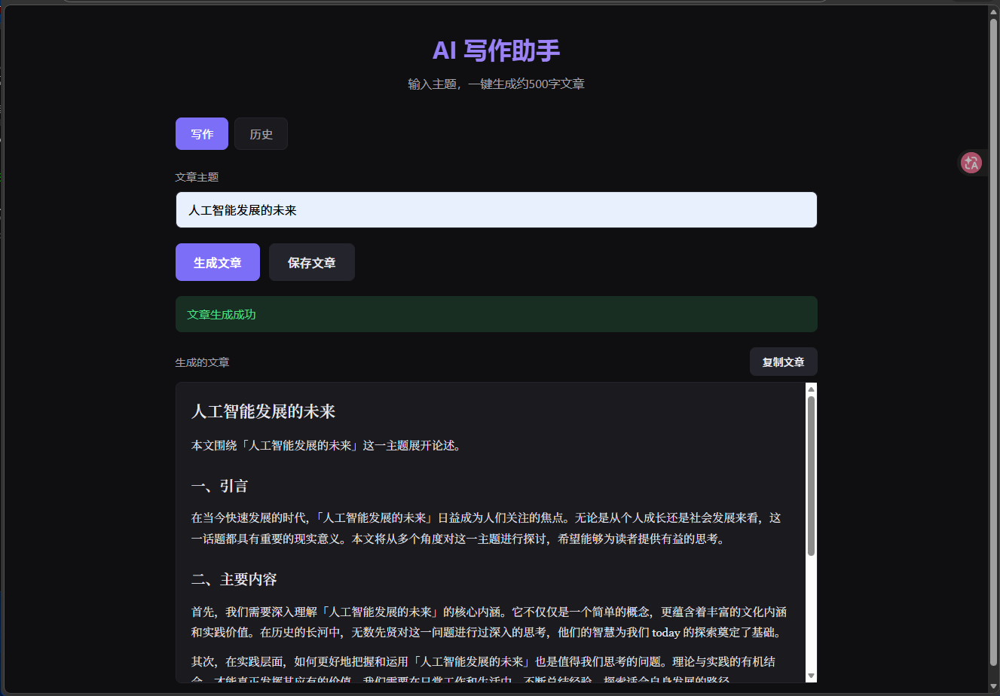
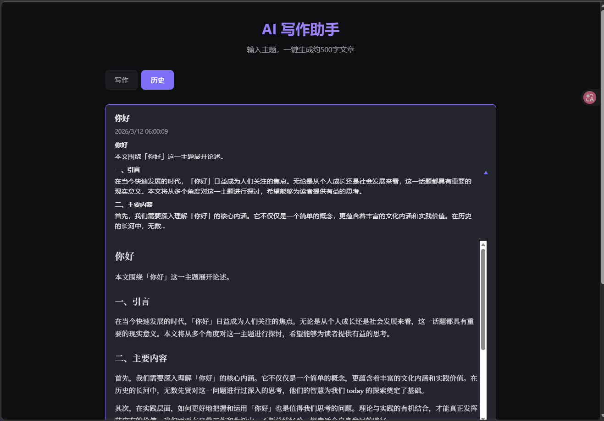

# AI Writer

A minimal AI-powered writing assistant that generates ~500-word articles from a topic. Built with React, FastAPI, and SQLite.

## Live Demo

https://ai-writer-psi.vercel.app

## Project Overview

## Demo




AI Writer lets you enter a topic and generate a full article with one click. Articles can be saved, viewed in history, and loaded back for editing. The backend uses an OpenAI-compatible API when configured, or falls back to a template article for local development and testing.

## Features

- **Generate article by topic** — Enter a topic and generate a ~500-word article in one click
- **Save article** — Store articles in SQLite
- **History list** — Browse all saved articles
- **Expandable history cards** — Click a card to expand and view the full article
- **Markdown rendering** — Articles are rendered as formatted markdown
- **Copy article** — Copy full article content to clipboard
- **Load to writing area** — Load any saved article back into the editor
- **Loading state** — Visual feedback with spinner while generating
- **Environment configuration** — Configure API via `.env` with `.env.example` as reference

## Tech Stack

| Layer      | Technology                                           |
|-----------|-------------------------------------------------------|
| Frontend  | React 18, Vite                                       |
| Backend   | Python, FastAPI                                      |
| Database  | SQLite                                               |
| AI        | OpenAI-compatible API (with fallback template mode)   |

## Architecture

Frontend (Vercel)  
↓  
FastAPI Backend (Railway)  
↓  
SQLite Database


## Project Structure

```
ai-writer/
├── backend/
│   ├── main.py          # FastAPI app and routes
│   ├── database.py      # SQLite operations
│   ├── models.py        # Pydantic models
│   ├── ai.py            # Article generation (OpenAI-compatible)
│   └── requirements.txt
├── frontend/
│   └── react-app/       # React (Vite) SPA
├── .env.example         # Example env vars (no secrets)
└── README.md
```

## Getting Started
### Quick Start (Recommended)
```bash
git clone https://github.com/hsh1122/ai-writer.git
cd ai-writer

npm install
npm run dev
```

Then open in your browser:

http://localhost:3000

This command starts both:
- FastAPI backend
- React frontend

### Prerequisites

- Python 3.9+
- Node.js 18+

### Manual Start (Optional)
#### 1. Backend

```bash
# create virtual environment
python -m venv venv

# activate venv (Windows)
venv\Scripts\activate

# install dependencies
cd backend
pip install -r requirements.txt

# start backend server
uvicorn main:app --reload
```

Backend runs at: http://127.0.0.1:8000

#### 2. Frontend

```bash
cd frontend/react-app
npm install
npm run dev
```

Frontend runs at `http://localhost:3000`.

### 3. Open the app

Visit `http://localhost:3000` in your browser. Enter a topic and click **生成文章** (Generate Article).

Without an API key, the backend returns a template article. To use real AI, set the environment variables below.

## Environment Variables

Copy `.env.example` to `.env` in the project root, or set these in your shell:

| Variable         | Description                                          | Example                          |
|------------------|------------------------------------------------------|----------------------------------|
| `OPENAI_API_KEY` | API key for OpenAI-compatible service. Leave empty to use fallback. | `sk-xxx`                         |
| `OPENAI_BASE_URL`| Base URL for OpenAI-compatible API (optional)        | `https://api.openai.com/v1`      |
| `OPENAI_MODEL`   | Model name                                           | `gpt-4o-mini`                    |

Example `.env`:

```
OPENAI_API_KEY=sk-your-key-here
OPENAI_BASE_URL=
OPENAI_MODEL=gpt-4o-mini
```

**Note:** Do not commit real secrets. Add `.env` to `.gitignore` and keep it local.

## API Endpoints

| Method | Path       | Description        |
|--------|------------|--------------------|
| POST   | `/generate`| Generate article   |
| POST   | `/save`    | Save article       |
| GET    | `/history` | List saved articles|
| GET    | `/health`  | Health check       |

### POST /generate

**Request:**
```json
{"topic": "Artificial Intelligence and the Future"}
```

**Response:**
```json
{"article": "# Artificial Intelligence and the Future\n\n..."}
```

### POST /save

**Request:**
```json
{"topic": "AI Future", "article": "# AI Future\n\n..."}
```

**Response:**
```json
{"id": 1, "message": "保存成功"}
```

### GET /history

**Response:**
```json
{
  "articles": [
    {
      "id": 1,
      "topic": "AI Future",
      "article": "# AI Future\n\n...",
      "created_at": "2025-03-10T12:00:00"
    }
  ]
}
```

## Future Improvements

- [ ] Delete articles from history
- [ ] Search and filter history
- [ ] User authentication
- [ ] Article editing before save
- [ ] Export to Markdown/PDF
- [ ] Streaming generation for long articles
- [ ] Docker setup for easy deployment

## License

MIT
